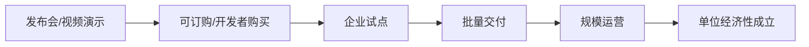

# 具身智能人形机器人产业链版图 - 知识图谱 v2.0

更新日期：2026-06-05

> 说明：本图谱用于产业研究与技术路线梳理，不构成投资建议。凡涉及未来产量、订单、成本、估值与供应份额的内容均为情景假设或公开资料归纳，需要持续复核。

## 0. 本轮更新摘要

相较桌面旧版 v1.0，本版新增四类信息：

- 整机产品：补充 Figure 03、1X NEO、UBTECH Walker S2、Unitree G1/R1/H2、Apptronik Apollo、Agility Digit、XPENG IRON、EngineAI T800/SE01/PM01、Fourier GR-3、智元机器人、乐聚 Kuavo 等。
- 开源生态：补充 NVIDIA Isaac GR00T、Hugging Face LeRobot、AgiBot World、OpenVLA、Open X-Embodiment、Unitree SDK/Open Source、Kuavo/OpenLoong/青龙等方向。
- 产业链结构：把“本体硬件供应链”与“Physical AI 软件栈/数据栈”拆开，避免只看执行器而低估模型、数据、仿真和部署工具。
- 商业化信号：把“发布演示”与“可交付订单/量产交付/真实场景运营”分层，降低被发布会叙事牵引的风险。

## 1. 总图谱

```mermaid
graph TD
  A[人形机器人产业链] --> B[整机与场景]
  A --> C[本体硬件]
  A --> D[感知与计算]
  A --> E[Physical AI 软件栈]
  A --> F[制造与供应链]
  A --> G[数据与开源生态]
  A --> H[商业化验证]

  B --> B1[工业/仓储: Digit, Walker S2, Apollo]
  B --> B2[通用/家庭: Figure 03, 1X NEO, Tesla Optimus]
  B --> B3[教育/科研/开发者: Unitree G1/R1, Kuavo, OpenLoong]
  B --> B4[汽车公司延伸: XPENG IRON, Tesla Optimus]

  C --> C1[旋转关节模组]
  C --> C2[线性执行器]
  C --> C3[灵巧手/触觉]
  C --> C4[减速器/丝杠/轴承]
  C --> C5[电池/热管理/线束]

  D --> D1[视觉: RGB/深度/双目/3D]
  D --> D2[力/触觉/IMU]
  D --> D3[边缘计算: Jetson Orin/Thor, 自研芯片]
  D --> D4[通信与安全冗余]

  E --> E1[VLA/机器人基础模型]
  E --> E2[运动控制/全身协调]
  E --> E3[仿真/合成数据/sim-to-real]
  E --> E4[远程监督/人类示教]
  E --> E5[任务编排/群控/工厂集成]

  F --> F1[精密加工]
  F --> F2[总装测试]
  F --> F3[可靠性验证]
  F --> F4[售后运维]

  G --> G1[LeRobot]
  G --> G2[Isaac GR00T]
  G --> G3[AgiBot World]
  G --> G4[OpenVLA/Open X-Embodiment]
  G --> G5[开源本体/SDK]

  H --> H1[样机演示]
  H --> H2[小批量试点]
  H --> H3[订单交付]
  H --> H4[规模化运营]
```

## 2. 整机公司与产品版图

| 公司/项目 | 代表产品 | 主要定位 | 2026 状态判断 | 关键观察点 |
|---|---|---|---|---|
| Tesla | Optimus | 工厂优先，远期家庭/通用 | 高关注，量产节奏仍需验证 | 是否进入稳定生产节拍；FSD/自研芯片/真实工厂数据能否迁移 |
| Figure | Figure 03 + Helix | 家庭与通用任务 | 产品叙事领先，真实交付仍需跟踪 | Helix 在非结构化家庭环境的成功率、遥操作占比、成本 |
| 1X | NEO | 家庭机器人 | 面向家庭预订/早期交付路径 | Redwood AI、Expert Mode、隐私与远程监督边界 |
| Agility Robotics | Digit + Arc | 仓储/物流/制造 | 商业部署证据较强 | GXO/Amazon/Schaeffler 等场景中单位经济性和维护成本 |
| Apptronik | Apollo | 仓储/制造/物流 | 面向企业场景试点 | 4 小时热插拔电池、模块化部署、合作客户转化 |
| UBTECH | Walker S2 | 工业人形机器人 | 已形成较强量产交付叙事 | 自主换电 3 分钟、订单兑现、汽车/工厂/口岸场景 |
| Unitree | G1/R1/H1/H2 | 开发者、教育、科研、部分商业 | 价格与开发者生态优势明显 | G1 低价普及、R1 入门化、H2 高端化、SDK 与社区扩散 |
| 智元机器人 | 远征/灵犀/精灵/AgiBot | 工业、服务、数据平台 | 国内头部之一，开源数据生态突出 | AgiBot World 数据规模、真实订单、整机平台稳定性 |
| XPENG | IRON | 汽车公司 Physical AI 延伸 | 计划 2026 量产，需验证 | 车端 VLA/芯片/供应链复用是否能降本 |
| EngineAI | SE01/PM01/T800 | 高动态全尺寸/科研展示/商业交付 | 2026 T800 交付信号增强 | T800 首批交付后的实际任务能力与安全边界 |
| Fourier | GR-2/GR-3 | 康养、陪伴、服务 | GR-3 强调护理与多模态交互 | 医疗康养场景合规、软硬件服务闭环 |
| 乐聚 | Kuavo | 开源人形机器人平台 | 开源/教育/科研属性强 | 开源社区活跃度、与 ROS/国产生态适配 |
| Boston Dynamics | Atlas | 高动态运动/研发标杆 | 技术标杆，商业化路径谨慎 | 电动 Atlas 的操作能力和商业场景 |
| Sanctuary AI | Phoenix | 通用工人/遥操作学习 | 早期试点 | 远程人类监督比例、任务库泛化 |

## 3. 本体硬件链条

### 3.1 高价值环节排序

| 层级 | 环节 | 价值来源 | 竞争变量 | 代表参与者/观察对象 |
|---|---|---|---|---|
| S | 关节执行器总成 | 单机用量大，BOM 占比高，可靠性决定整机寿命 | 扭矩密度、热管理、寿命、成本 | 三花智控、拓普集团、鸣志电器、汇川技术、Unitree 自研模组 |
| S | 灵巧手与触觉 | 决定从“会走”到“会干活” | 自由度、力控、触觉阵列、耐用性 | 灵心巧手、因时机器人、帕西尼、汉威科技、Unitree Dex 系列 |
| A | 丝杠/减速器/轴承 | 精密传动国产化和成本下降核心 | 加工精度、寿命、一致性 | 绿的谐波、双环传动、五洲新春、恒立液压、贝斯特 |
| A | 感知模组 | 低成本 3D 感知与近场操作 | RGB/双目/深度/力觉融合 | 奥比中光、舜宇、海康机器人、UBTECH 双目方案 |
| A | 边缘计算 | VLA/控制/感知融合的算力底座 | TOPS/W、实时性、生态 | NVIDIA Jetson Orin/Thor、Tesla 自研芯片、地平线、华为昇腾 |
| B | 电池/充换电 | 续航、换电、工厂 24/7 运营 | 能量密度、安全、快换结构 | UBTECH Walker S2 换电方案、1X NEO 自充电 |
| B | 线束/连接器/散热 | 可靠性基础设施 | 抗弯折、轻量化、热设计 | 消费电子与汽车供应链复用 |

### 3.2 供应链判断

- 中国优势：精密制造、零部件迭代速度、成本工程、整机试制速度、应用场景密度。
- 美国优势：基础模型、芯片生态、机器人软件平台、资本和高端人才集中度。
- 共同瓶颈：可靠性、真实任务成功率、维护成本、安全认证、数据闭环。
- 最容易被低估的环节：灵巧手耐用性、线束寿命、热管理、维修工时、现场集成软件。

## 4. Physical AI 软件栈

| 层级 | 模块 | 关键问题 | 代表项目/公司 |
|---|---|---|---|
| L0 | 硬实时控制 | 平衡、避障、力控、跌倒保护 | Unitree、Boston Dynamics、Tesla、Agility |
| L1 | 技能策略 | 抓取、搬运、整理、开门、上下料 | LeRobot、GR00T、OpenVLA、各家闭源策略 |
| L2 | VLA/机器人基础模型 | 语言、视觉、动作联合建模 | Figure Helix、NVIDIA GR00T、OpenVLA、XPENG VLA、AgiBot GO-1 |
| L3 | 数据闭环 | 示教、遥操作、仿真、合成数据、失败样本回流 | AgiBot World、Open X-Embodiment、LeRobotDataset、1X Expert Mode |
| L4 | 场景编排 | 多机器人调度、WMS/MES 集成、权限与安全 | Agility Arc、UBTECH BrainNet 2.0/Co-Agent、工厂集成商 |

核心判断：2026 年竞争正在从“谁的机器人更像人、走得更稳”转向“谁能用可复用的数据与模型，把任务成功率稳定推过商业阈值”。

## 5. 开源项目与数据生态

| 项目 | 类型 | 价值 | 当前可用性判断 |
|---|---|---|---|
| NVIDIA Isaac GR00T | VLA/机器人基础模型与训练部署栈 | 面向通用机器人技能，提供预训练权重、微调、推理、TensorRT 部署路径 | 高价值，偏研究和开发者早期使用 |
| Hugging Face LeRobot | 机器人学习库、数据格式、策略训练工具 | 标准化真实机器人数据、策略训练、硬件接口；已支持 Unitree G1 等硬件 | 高价值，开源生态核心底座 |
| AgiBot World | 大规模机器人操作数据集与 GO-1 模型 | 百万级轨迹、百台机器人、双臂操作场景，补齐中国具身数据生态 | 高价值，数据体量和任务多样性突出 |
| OpenVLA | 开源 VLA 模型 | 学术/开发者可复现的视觉语言动作模型路线 | 高价值，适合模型侧参考 |
| Open X-Embodiment / RT-X | 跨机器人数据集/模型 | 早期证明跨本体数据融合路线 | 基础性强，适合对标数据标准 |
| Unitree Open Source / SDK | 整机 SDK/开发者接口 | 低成本硬件 + 社区开发扩散 | 高扩散潜力 |
| Kuavo / OpenLoong / 青龙 | 开源本体/人形机器人平台 | 国产开源硬件与控制栈 | 适合教育、科研、生态孵化 |

## 6. 商业化分层

| 层级 | 判定标准 | 当前接近者 |
|---|---|---|
| 发布演示 | 视频/展会展示能力 | 大多数整机厂 |
| 可订购 | 明确售价、订金或开发者版本 | Unitree G1/R1、1X NEO |
| 企业试点 | 进入工厂/仓库/物流试用 | Figure、Apptronik、Agility、UBTECH、智元、Fourier |
| 批量交付 | 数百台级交付或明确生产线 | UBTECH Walker S2、EngineAI T800 需持续验证 |
| 规模运营 | 多客户、多站点、持续稳定运行 | Agility Digit 相对领先 |
| 单位经济性成立 | 机器人小时成本低于人工/替代方案并含维护 | 全行业仍待验证 |

## 7. 中美竞争格局

| 维度 | 美国 | 中国 | 判断 |
|---|---|---|---|
| AI 模型 | Figure Helix、Tesla FSD 迁移、NVIDIA GR00T、1X Redwood | XPENG VLA、AgiBot GO-1、各家闭源模型 | 美国基础模型生态强，中国正在补数据与场景 |
| 芯片/算力 | NVIDIA Jetson/Thor、Tesla 自研 | 昇腾、地平线、国产替代推进 | 边缘算力生态仍由 NVIDIA 牵引 |
| 硬件供应链 | 高端研发强，制造外包多 | 成本、供应链响应、试制速度强 | 中国硬件降本优势明显 |
| 场景 | 仓储、汽车工厂、家庭 | 工业、商业服务、教育、物流、口岸 | 中国场景更密集，美国单场景商业验证更严 |
| 开源生态 | LeRobot、GR00T、OpenVLA | AgiBot World、Kuavo/OpenLoong、Unitree SDK | 开源正在成为数据和人才入口 |

## 8. 投资/研究跟踪框架

### 8.1 关键指标

| 指标 | 触发信号 | 解读 |
|---|---|---|
| 整机季度交付量 | 单厂商 >1000 台/季 | 从试点进入放量验证 |
| 真实任务成功率 | 连续任务成功率 >95%，且含异常恢复 | 商业替代开始接近可行 |
| 机器人小时成本 | 含折旧、维护、遥操作后低于人工 | 单位经济性核心 |
| 遥操作/监督占比 | 持续下降 | 模型泛化真实进步 |
| 维护间隔 | MTBF、关节/手部寿命提升 | 从演示机到生产工具的分水岭 |
| 开源数据增长 | 高质量真实轨迹持续增加 | 模型迭代速度指标 |
| 大客户复购 | 试点客户追加订单 | 商业价值强证据 |

### 8.2 风险红线

- 只发布视频、不披露真实任务指标。
- 订单金额大但交付节奏、验收标准和回款不清晰。
- 过度依赖遥操作，却包装成完全自主。
- 灵巧手、关节、线束、散热等可靠性没有长期数据。
- 估值已经定价百万台级市场，但现实仍停留在百台/千台试点。

## 9. 2026-2028 情景假设

| 情景 | 概率 | 2027 全球出货假设 | 核心条件 |
|---|---:|---:|---|
| 乐观 | 25% | 5-10 万台 | 工业场景出现可复用任务模板；中美头部厂商均进入千台级交付 |
| 基准 | 50% | 2-5 万台 | 物流/制造/教育先放量，家庭仍早期；成本下降但可靠性拖慢扩张 |
| 悲观 | 25% | <1 万台 | AI 泛化与可靠性不达标，订单转化慢，资本退潮 |

## 10. 下一版待补

- 各核心零部件单机用量与价格区间：关节、丝杠、减速器、灵巧手、传感器、算力模组。
- 中国 A/H 股标的按“订单确认度、客户绑定、国产替代弹性、估值风险”重新打分。
- 整机厂产品矩阵扩展：智元、银河通用、星动纪元、众擎、逐际动力、加速进化、达闼等。
- 开源本体对比：Kuavo、OpenLoong、Berkeley Humanoid Lite、RoboParty Origin、Unitree G1。
- 建立季度复盘表：发布、交付、订单、开源、融资、事故、安全认证。

## 11. 资料来源

详见 [sources/humanoid-robot-sources-2026-06-05.md](humanoid-robot-sources-2026-06-05.md)。
