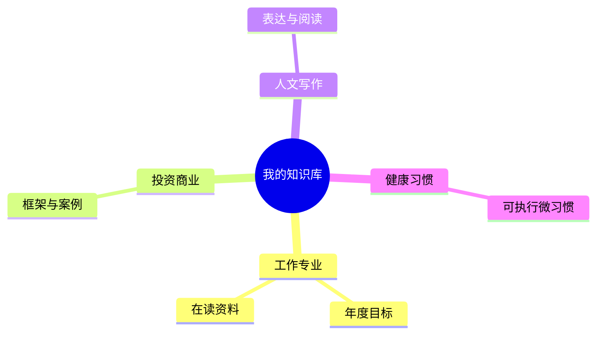

# 知识导航总图（初稿）

> 在 Hermes 中运行 `/map-domain` 根据你的 USER.md 重新生成。

```mermaid
mindmap
  root((我的知识库))
    工作专业
      年度目标
      在读资料
    投资商业
      框架与案例
    人文写作
      表达与阅读
    健康习惯
      可执行微习惯
```

## 本季度焦点

- （待填写）

## 变更记录

| 版本 | 日期 | 说明 |
|------|------|------|
| v0.1 | 2026-05-26 | 脚手架初稿 |
